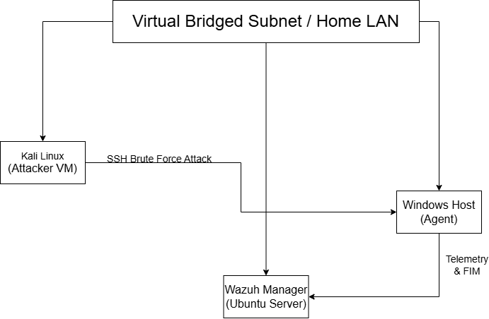
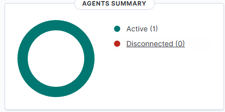
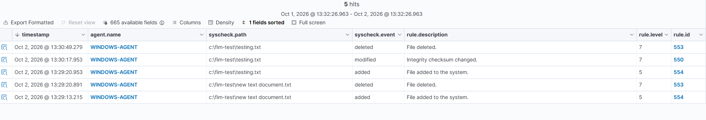
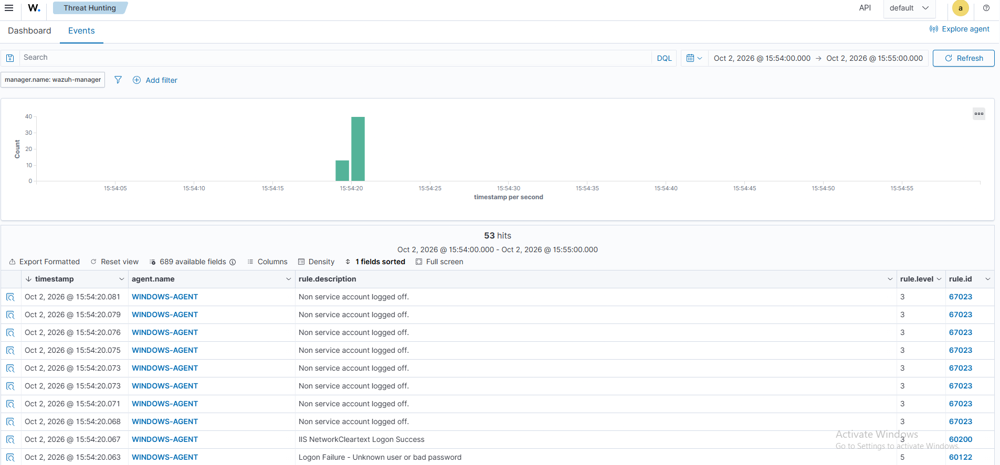

# Wazuh Home SIEM Lab

A hands-on home lab where I utilized a Wazuh SIEM, connected a Windows endpoint, simulated a brute-force attack using Kali Linux, and wrote custom detection rules.

> Built following Royden Rebello's (TheSocialDork) guide, with my own setup notes, attack simulations, rules, and troubleshooting fixes added.

**Status:**
Phases 1 & 2 complete (SIEM deployment, FIM testing, Hydra attack simulation, MITRE mapping, and custom detection rules).
- Next up: Phase 3 (Sysmon integration)
- Planned: Phase 4 (Active Response & incident report)

---

## Overview

I built this lab to get real hands-on practice with blue team defense and detection engineering. Instead of just reading about how a SIEM works, I wanted to see how security logs travel from an endpoint to a dashboard, watch an attack happen live, and write my own rules when the default system doesn't cut it.

## Architecture

| Component | Host | Role |
| :--- | :--- | :--- |
| Wazuh Manager | Ubuntu Server (VirtualBox, bridged) | Collects, reads, indexes, and stores agent log data |
| Wazuh Agent | Windows Host Machine | Sends security logs, login events, and file integrity data to the manager |
| Kali Linux | VM (VirtualBox, bridged) | Attacking machine used to simulate brute force logins |



## Tools Used

Wazuh, Ubuntu Server, VirtualBox, Windows 10, Kali Linux, Hydra, OpenSSH Server, Visual Studio Code

## Setup (Summary)

1. **Network:** Set up Ubuntu Server in VirtualBox using a Bridged Adapter so the VM could get its own local IP address on my home network.
2. **Manager Install:** Ran the Wazuh install script to set up the manager, indexer, and web dashboard, then verified installation over HTTPS.
3. **Agent Install:** Installed the Wazuh agent on my Windows host using the official installer.
4. **Agent Registration:** Used `manage_agents` on Ubuntu to create and copy an authentication key, pasted it into the Windows agent manager, set the manager's IP, and verified the agent showed as `Active`.
5. **FIM Setup:** Added a test folder path inside the `<syscheck>` block of `ossec.conf` on Windows, restarted the agent, and enabled real-time file monitoring.



## File Integrity Monitoring (FIM) Tests

I created, edited, and deleted files in the monitored folder to see how Wazuh tracks file system changes in real time.

| Action | Result in Wazuh |
| :--- | :--- |
| Create file | Wazuh alerted that a file was added (`syscheck.event: added`), showing the file path, timestamp, and rule # and ID. |
| Modify file | Wazuh alerted that the file changed (`syscheck.event: modified`). |
| Delete file | Wazuh alerted that the file was removed (`syscheck.event: deleted`) with the exact deletion time. |



## Attack Simulation

I simulated a password guessing attack from Kali against my Windows machine over SSH (Windows Home does not support Remote Desktop, so I enabled Windows OpenSSH Server instead).

- **What I ran:** `hydra -l testuser -P wordlist.txt ssh://x.x.x.x` (Targeted a local account called testuser with an 8-word password list ending in the correct password).
- **What Wazuh caught:**
  - Rule `60122` (Level 5): *Logon Failure* triggered once for each wrong password.
  - Rule `67023` (Level 3): *Non-service account logged off* triggered once for each wrong password.
  - Rule `60200` (Level 3): *Windows Logon Success* triggered when Hydra found the right password.
- **What Wazuh missed:**
  - It treated every bad attempt as an isolated mistake instead of grouping them together as an active brute-force attack.
  - It automatically tagged the alerts with `T1531` (Account Access Removal), which is the wrong MITRE ATT&CK tactic for password guessing.
  - The Windows OpenSSH log did not include the attacker's source IP address (`x.x.x.x`), making it hard to see who was attacking.



## Custom Rules

Custom rules are stored in [`/rules`](rules/).

| Rule ID | What it detects | Why I wrote it |
| :--- | :--- | :--- |
| `100010` | Multiple SSH login failures within 60 seconds | Default rule 60122 only makes low-level (Level 5) noise for single bad logins. My rule groups multiple failures into a single high-priority (Level 10) brute-force alert and assigns the correct MITRE ID (T1110). |

**How I tested it:** Reran the Hydra attack from Kali to confirm the new Level 10 alert fired on the dashboard.


## MITRE ATT&CK Mapping

| Detail | Default Wazuh Alert | With Custom Rule |
| :--- | :--- | :--- |
| **Attack Action** | Hydra SSH Brute Force | Hydra SSH Brute Force |
| **Real MITRE ID** | T1110 (Brute Force) | T1110 (Brute Force) |
| **MITRE Tactic** | Credential Access | Credential Access |
| **Wazuh Tagged ID** | T1531 (Incorrect - Account Removal) | T1110 (Corrected via custom XML) |
| **Rule Fired** | 60122 (Level 5 - single bad logins) | 100010 (Level 10 - brute force detected) |
| **Did It Catch It?** | Partial (Saw failed logins, missed the attack) | Yes (Triggered on 5+ failures in 60s) |
| **Log Blindspot** | Missing attacker IP from OpenSSH event | Missing attacker IP from OpenSSH event |

## Issues & Fixes

| Problem | How I fixed it |
| :--- | :--- |
| Agent wouldn't connect because `manage_agents` was tied to a VirtualBox host-only IP | Removed the agent on Ubuntu and re-added it with IP set to `any`. |
| Windows Home edition does not support Remote Desktop (RDP) Server | Switched to SSH; installed and started OpenSSH Server using Windows Optional Features and PowerShell. |
| Kali could not ping the Windows target | Realized Windows Firewall blocks ping (ICMP) by default; tested the SSH port directly instead and continued the lab. |

## What I Learned

- Default SIEM alerts don't always spot attack patterns & need specific rules to tell the difference between a user typo and brute-force password attacks.
- You can't always trust default MITRE tags; validating alerts manually is important for accurate categorization.
- Working around OS limitations (like Windows Home missing RDP) is common in real IT and security environments.

## Next Steps

- [ ] Install Sysmon on Windows for better process and network logs
- [ ] Set up Active Response to automatically block attacker IPs with the firewall
- [ ] Write a sample incident report for the SSH attack

## Credits

- Guide: Royden Rebello (TheSocialDork), Wazuh Home Lab - SIEM and File Integrity Monitoring (https://www.youtube.com/watch?v=QT81wcuoRFY&t=809s)
- [Wazuh documentation](https://documentation.wazuh.com)

## Disclaimer

All testing was conducted on private machines in an isolated home lab. Real passwords, keys, and IP addresses have been removed or masked.

---

## Repo Structure

```text
wazuh-home-lab/
├── README.md
├── screenshots/
├── configs/     # sanitized ossec.conf changes
└── rules/       # custom rules
